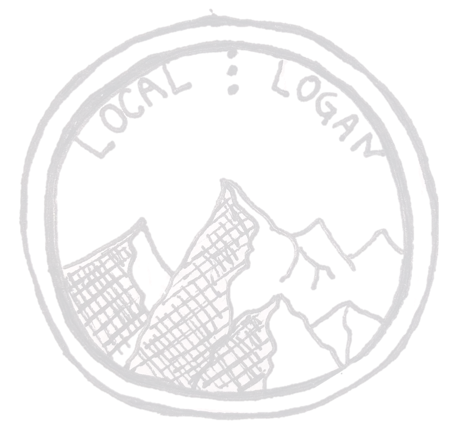

# LocalLogan

This web project is dedicated to making Logan, Utah and Cache Valley area a better place for everyone.

What you can expect to find here:
- Local date ideas
- News from around Cache Valley
- Restauraunt picker
- And more features our team is working to add! Any feature requests are welcomed and greatly appreciated!

## Our team
Name | Position
------------- | -------------
Nikhil Math  | Developer
Austin Thornley | Developer
Forrest Olson | Developer

## Project setup
Clone the repo, navigate to the project folder, and run these commands.
```
npm install
```

### Compiles and hot-reloads for development
```
npm run serve
```

After running the last command, your terminal should say which port the app has started on. Navigate to that and you should see the main page.

